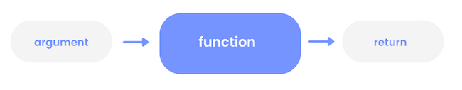
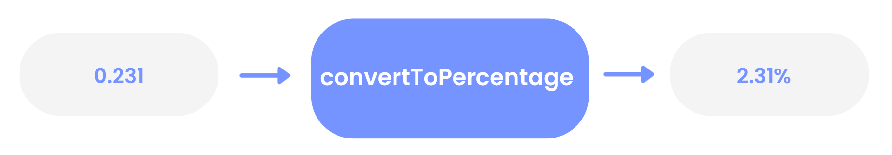

# Preparation
## Install a UNIX based operating system
### Learning Objectives
- [ ] Check you have a Unix based operating system
- [ ] If required, setup a Unix based operating system
- [ ] Download and install Node using nvm

If you get stuck on any of the below or above instructions, please post in your class channel on Slack. 

If you have a Mac or Linux machine already, you already have a UNIX based operating system. All HYF-supplied laptops run Linux. If you have your own machine and it runs Windows, you should have set up a Linux partition.

❗❗Check if you already have NodeJS installed by running `node -v` in a terminal. The command should return a version number like `v22.11.0.` . If it does, you can skip the next steps.

### On Ubuntu
1. Install nvm by running the following commands in your terminal:
  
```bash 
curl -o- https://raw.githubusercontent.com/nvm-sh/nvm/v0.40.1/install.sh | bash
```

2. After the installation is complete, you’ll need to source the nvm script by running:
  
```bash 
source ~/.bashrc
```

3. Install the latest LTS version of Node.js by running:
  
```bash 
nvm install --lts
```

4. Check that you have successfully installed Node.js by running:
  
```bash 
node -v
```

You should see a version number like `v22.11.0.`

5. Check that you have successfully installed npm by running:
  
```bash 
npm -v
```

You should see a version number like `10.9.0.`

### On Mac
1. Install the the Xcode Command Line Developer Tools by running the following command in your terminal:
   
```bash 
xcode-select --install
```

These may already be installed, in which case you will see “`xcode-select: note: Command line tools are already installed.`” and can continue to the next step.

2. Create a (Non-Login Interactive) Shell Configuration File:

```bash 
touch ~/.zshrc
```

3. Install nvm:
   
```bash 
curl -o- https://raw.githubusercontent.com/nvm-sh/nvm/v0.40.1/install.sh | bash
```

4. After the installation is complete, you’ll need to source the nvm script by running:
   
```bash 
source ~/.zshrc
```

5. Install the latest LTS version of Node.js by running:
   
```bash 
nvm install --lts
```

6. Check that you have successfully installed Node.js by running:
   
```bash 
node -v
```

You should see a version number like `v22.11.0.`

7. Check that you have successfully installed npm by running:
   
`npm -v`

You should see a version number like `10.9.0.`

## 1. Define a Computer
### Learning Objectives
- [ ] Define a computer
  
Modern computers are complicated: it would be too difficult and time-consuming to list all the components that make up a modern computer. So to build our mental model, we will use this simple definition of a computer:

**A computer is a device used to store and perform operations on data.** 

--- 

### 2. Interface
### Learning Objectives
- [ ] Categorise different interfaces

We want to use computers without understanding exactly how they are built. Every day we ask machines to do things, and usually we have no idea how these machines work. We could not use modern technology if we had to understand it completely before we could use it; it would take too long! Instead we use interfaces. Think of an interface as a gate that allows communication between a user and a machine. The user asks the machine to do things via the interface.

Think about a cash machine (ATM). We go to a hole in the wall with a screen and a keypad. The screen and the keypad are the user interface. We press the buttons and ask the machine to do things - like giving our balance, or withdrawing some money from an account. We don’t need to understand how the information it tells us comes on the screen.

### 🏋🏻‍♀️ Exercise
Define the user interface for these devices:
- a calculator
- a microwave
- a desktop lamp
- Facebook
- Alexa
- ChatGPT

### 3. Terminal
### Learning Objectives
- [ ] Identify the terminal and its purpose
- [ ] Execute commands in the terminal

Programmers need interfaces to ask computers to do things. A computer terminal is an interface where programmers can issue commands to a computer. Because users enter text instructions and receive text output, we say that the terminal is a text-based interface.

We can input a command into the prompt and hit enter. The terminal then passes this command to the computer to execute. Find your own terminal and type `pwd` to see where you are.

---

### 4. Data
### Learning Objectives
- [ ] Define data type, expression, and operator

We’re going to focus on the JavaScript programming language. A programming language organises data with rules so we understand what we can and cannot do with it. Languages split data up into different categories called data types. In JavaScript, we have five data types. We will look first at numbers and strings.

#### Number data type
`10` is an example of the number data type. `3.14` is also part of the number data type; both integers (whole numbers) and non-integers are types of number. `-15` is also part of the number data type. Positive and negative numbers, as well as `0`, are all types of number.

#### String data type
A string is a sequence of characters demarcated by quotes.
`"Hack Your Future"`;


#### Creating expressions
Think of the numbers `10` and `32`. We could ask questions about these numbers, like: What is the sum of 10 and 32? In English we can say this in many ways, but in JavaScript we can say this using numbers and an `operator`. Just like in mathematics, “the sum of 10 and 32” can be written as `10 + 32`:

__In JavaScript, `+`  is an operator.__

An operator represents an operation, or act. It’s a symbol. In this example, `+` represents the operation “make the sum of the numbers”. It symbolises addition.

__The combination of symbols 10 + 32 is an expression__ 

An expression is a value or any valid combination of values and symbols that results in a single value. `10` is also an expression. It evaluates to the value 10.

`"Hack Your Future"` and `"Hack Your " + "Future"` are also both expressions - both evaluate to the value `"Hack Your Future"`.

---

## 5. REPL
### Learning Objectives
- [ ] Define the features of the Node REPL
- [ ] Evaluate expressions using your mental model of JavaScript
- [ ] Evaluate expressions using the Node REPL

Computer programs are built from many expressions. We must understand how expressions are evaluated to understand how computer programs are executed.

We can take an expression like `36 * 45` and ask what it evaluates to. If we know what the `* `operator represents (multiplication) and if we understand the arithmetic rules represented by the operation we can evaluate this expression ourselves.

Happily, computers can evaluate expressions for us.

__NodeJS__ is an application that runs JavaScript programs. In other words, NodeJS can understand and execute programs written in JavaScript. One feature of Node is the __REPL__

__REPL is a special type of program that stands for:__

- __Read :__  Users enter some code that Node will read
- __Evaluate :__ Node will then evaluate this code
- __Print:__  Node will print the result to the terminal
- __Loop:__ Node will loop back to the beginning and prompt users to input some more code
  
With a REPL we can run pieces of code and look at what happens. We input JavaScript instructions that are then executed by NodeJS. The REPL replies with, or prints out, the result of this execution.

### 🏋🏻‍♀️ Activity
In this activity, you’ll check you’re ready to use the Node REPL on your machine.
- Open the terminal on your computer
- Check you’ve got Node installed on your computer
- Start the Node REPL in your terminal by 
- Enter the each of the following expressions : `10 + 32` and `32/10` into the REPL one at a time and then press enter to check the result. 

❗If you don’t know how to do any of the steps above, then try searching for an appropriate command online. Searching for things when you’re stuck is super important part of being a developer!

---

## 6. Prep Dir
### Learning Objectives
- [ ] Create a working prep directory for the module

### Create a working directory for the module
- Fork [the coursework module](https://github.com/HackYourFutureBelgium/Module-Structuring-and-Testing-Data), clone it and open it in VSCode.
- In your VSCode terminal, navigate to the root of your project directory.
- Create a new directory called `prep` to store all the files you’ll be working on for preparation.
- As you work through the module, you’ll be creating files in this directory to code along with the prep content. You are expected to code along with the a content.

For simple one liners, use the terminal REPL to run the code. For more complex problems, create files in the prep directory and write the code there. Make commented notes as you go along explaining why you’re doing what you’re doing. Your future self will thank you.

__🔑 The most important thing is to secure your understanding.__ The prep content is designed to help you understand the concepts you’ll be working with in the module. Don’t just read it, code along with it. Also take notes, draw diagrams, pose your own questions and try to answer them.

To really understand programming, you need to write the code yourself, and do the exercises. You must take [active part](https://www.pnas.org/doi/10.1073/pnas.1319030111) in your learning to succeed.


## 7. Variables
### Learning Objectives
- [ ] Identify the syntactic features of a variable declaration
- [ ] Explain why we use variable declarations
- [ ] Create strings using variables and template literals

In programming we often want to reuse our work. Consider the string: `"Hello there"`. Suppose we want to create different greetings for different people, like: `"Hello there, Alicia"` `"Hello there, Barny"`. We can use a variable to store this string and reuse it. A __variable__ is a label for a piece of data. We assign a piece of data to a label and then refer back to this label, in place of the data. 

We can create a variable in our program by writing a variable declaration. 


```js
const greeting = "Hello there";
```

Break down the different syntactic elements of this variable declaration:
- `const` is a keyword used to indicate we’re creating a variable.
- `greeting` is the identifier - it can be used to refer to a variable after it has been declared.
- `= `is the assignment operator. It means assign to the label greeting the value of the expression on the right hand side.
- `"Hello there"` - this is the expression whose value we’re assigning to the label greeting.

🏋🏻‍♀️ __Exercise :__ Type this variable declaration into the REPL:
```js
const greeting = "Hello there";
```
Now refer to the label greeting in the REPL:

```js
`${greeting}, Alicia`
```
Our greeting variable is stored in memory. We can reuse it to build more expressions:

```js 
`${greeting}, Barny`
```
With template literals, we can insert expressions into strings to produce new strings. Any time we want to reference a variable inside a template literal we use a dollar sign `$` and a set of curly braces `{}`. We can put any expression (e.g. a variable name) inside the curly braces. The value that expression evaluates to is then placed inside the string.

__String literal :__

```js
const greetAlicia = "Hello there, Alicia";
```
In this example, we don’t use a variable or a template to create a string. Instead we write a string `"Hello there, Alicia"`.

A sequence of characters enclosed in quotation marks is called a string literal. `"Hello there, Alicia"` is a string literal.

Similarly, `10` is a __number literal__.

```js 
const name = "Alicia";
const greetAlicia = `Hello there, ${name}`;
```

```js
const greeting = "Hello there";
const name = "Alicia";
const greetAlicia = `${greeting}, ${name}`;
```

The `greetAlicia` variable doesn’t remember whether you used variables to make it or not - in all three cases, greetAlicia contains the string "Hello there, Alicia". Once a value is made, it doesn’t matter how it was made.

---

## 8. Declarations and Statements
### Learning Objectives
- [ ] Define a declaration
- [ ] Define a statement
- [ ] Describe the difference between a declaration and a statement
- [ ] Describe the difference between let and const


```js 
let versionNumber = "2.0.0"; // declaration
versionNumber = "2.0.1"; // statement
```
The code above has one variable declaration and one statement.
- The first line is a __declaration :__ - creating a variable `versionNumber` with a value of `"2.0.0"`
- The second line is a __statement:__  reassignment (changing the value associated with an identifier) of the value of `versionNumber` to `"2.0.1"`
In this example, we’ve used the `let` keyword to declare a new variable. The let keyword allows us to create new variables like the `const` keyword.

However, we can reassign the value of a variable that is declared with the `let` keyword.

If we’d used `const` to declare `versionNumber`, we wouldn’t be allowed to reassign it a new value.

In JavaScript, we build up programs by combining declarations and statements.


---

## Functions
### Learning Objectives
- [ ] Define a function in programming
- [ ] Evaluate a function expression
- [ ] Call a function with an input in REPL
- [ ] Functions = reusable chunks of code.

Now, instead of adding or multiplying numbers, we’ll consider `10.3`. “What is the nearest whole number to `10.3`?”

The process of finding the nearest whole number to a decimal number is called __rounding__. So we could rephrase our question as: “What does the number `10.3` round to?”

There is no operator for rounding the number `10.3` in JavaScript. But we will want to round numbers again and again. We should use a function which is __a reusable set of instructions.__

`Math.round` is a function. Because a function is a reusable set of instructions, `Math.round` rounds any number.

Functions usually take inputs and then apply their set of instructions to the inputs to produce an output.

#### 🧪 Try it yourself
- Write `Math.round` in the Node REPL
- Hit enter to evaluate our expression
  
The REPL output `[Function: round]` is telling us `Math.round` is a function.

---

## Scripts
### Learning Objectives
- [ ] Execute a JavaScript file with Node

So far we’ve seen how expressions can be evaluated using the Node REPL. The Node REPL is useful for evaluating expressions quickly.

But usually, our programs have many instructions, and we want to keep and re-run them instead of typing them out each time. So we save our instructions in files. Node can also execute instructions written in a file.

We use the node command to run a JavaScript file in the terminal. A JavaScript file ends with `.js` - this is the “file extension”.

Let’s suppose we have a file `age.js` We run the command `node age.js`. This terminal command is an instruction to execute the program written inside `age.js`. Our program has five lines. So the computer will read and execute the program one line at a time:

```js
const yearOfBirth = 1990; // declaration
let currentYear = 2023; // declaration

currentYear++; // statement
`I am ${currentYear - yearOfBirth} years old`; // statement
```

#### 🏋🏻‍♀️ Activity
Check you can run a file with Node:
- In your terminal, create a new file called `example.js`.
- Try writing a few lines in the file.
- Get Node to run this file. (Don’t use the REPL now - you should run a command to execute the whole file.)

Once the computer executes these statements, the execution of the program is complete. But we’re left with a problem. With the REPL, when the user inputs an expression statement or declaration, the computer reads and executes the line and immediately prints feedback to the terminal. With a file, the computer will execute each line sequentially until completion without printing the values of each expression it evaluates.

So this new problem can be expressed as a question:

__❓ Problem : “How can we check what the values evaluated to in our program during execution?”__

---

## Logging
### Learning Objectives 
- [ ] Use `console.log` to print a value

### Printing to the terminal
To look at values when our program runs, we can use a function called `console.log`. It will record something that happens in our program and print it to a text based interface.

`console.log` logs the result of expressions while our program is executing. This is very useful for complex programs when we need to check what values expressions evaluate to at specific moments of our program execution.

```js
console.log("hello there!");
```
We should see the string "hello there!" logged out in the terminal.


---

## Errors
### Learning Objectives 
- [ ] Identify the cause of syntax errors in small snippets of JavaScript
- [ ] Interpret syntax error messages to determine their cause and how to fix them

Recall: A programming language is a set of rules for writing computer instructions. So we need to understand what happens when we break those rules.

Let’s take an example:
```js
const firstName = "Francesco;
const age = 33;
const nationality = "Italian";
```

On line 1, we have a variable declaration, but the string has a missing `"` We’re not obeying the syntactic rules for JavaScript: the rules for writing expressions, statements and other parts of the language.

When we execute the code above, we get this:
```js
const firstName = "Francesco;
                  ^^^^^^^^^^^

Uncaught SyntaxError: Invalid or unexpected token
```
We get a __SyntaxError__ message. This error message is telling us that we’ve broken the rules of the language.

### 🧪 Predict, Explain
Each block of code in this activity is broken. Before you run each block of code:
- Predict the error.
- Explain why the error happened.

```js
const volunteer = "Shadi";
const volunteer = "Abdi";
```

```js
const volunteer = "Shadi";
volunteer = "Hinde";
```

```js
console.log(Math.round(10.3);
```

### Saving return values
We can store the return value of a function in a variable. Function calls are also expressions. This means their value can also be stored in variables, just like with operations on numbers or strings.

Suppose we have a file `arithmetic.js` containing this code:

```js
const result = Math.round(10.3);
``` 

When this program is executed, it creates a variable called `result` and assigns to it the return value of the function, in this case the rounded number. So `result` will have a value of `10`.


#### 🧪 Predict, Run, Observe
```js
const result = console.log("hello world");
```

1. Predict what result will evaluate to when the code above runs.
2. Execute this line in the Node REPL.
3. Evaluate the value of the result variable to observe what happens.
   
When this program runs, the variable result will evaluate to `undefined`. `undefined` is a data type in JavaScript which usually means no value has been assigned. Unlike the `number` data type, which contains many possible values (1, 2, 10.3, etc), the `undefined` data type has exactly one value, `undefined`.

This can feel confusing as `console.log` is a function with a set of instructions. `console.log` does have an effect: it logs values to the console. However, `console.log` doesn’t produce an output that we can use inside the rest of our running program.

__💡tip : console.log is used to print values to the terminal. It doesn’t produce an output in the running program.__

---

## Percentages
### Learning Objectives 
- [ ] Construct simple expressions to represent a calculation

Let’s begin with this problem:

Given a decimal number I want to convert it into a percentage format. For example, given the decimal number `0.5` we return the string `"50%"`. Given the decimal number `0.231` we return the string `"23.1%"`.

Restating the problem : Our function must convert any decimal to a percentage. We have used functions already. Here are some functions we’ve used:

```js
console.log("hello world"); // logs "hello world" to the console
Math.round(3.141); // evaluates to the whole number 3
```

All these expressions are function calls: we’re passing input (`"hello world"` or `3.141`) to the functions (`console.log` or `Math.round`) to use their functionality. `Math.round` and `console.log` are functions that the JavaScript language designers have written and stored inside the language, because everyone needs them all the time.

No such pre-built function converts any number to a percentage, so we must write our own. We’re going to create a function called `convertToPercentage` with the following requirements:
- Given a number input
- When we call convertToPercentage with the number input
- Then we get back a string representing the percentage equivalent of that number.

Here are some examples:

```js
convertToPercentage(0.5); // should return "50%"
convertToPercentage(0.231); // should return "23.1%"
```

#### Useful expressions
It is often helpful to solve a problem in one specific instance before doing it for all cases.

We’re not going to define our function yet. Instead we will work out what our function should do. Then we’ll define a function which does the same thing.

In programming, we always try the simplest thing first. Let’s consider how to convert just one number to a percentage. Look at this variable declaration:

```js
const decimalNumber = 0.5;
```
We want to create an expression for the percentage using the value of `decimalNumber`. To convert to a percentage, we will multiply the number by 100 and then add a "%" sign on the end.

```js
const decimalNumber = 0.5;
const percentage = `${decimalNumber * 100}%`;
```
Recalling template literals, the expression in the curly braces will be evaluated first and then inserted into the string, giving us the percentage string.

### 🏋🏻‍♀️ 🧪  Calculating the area and perimeter of a rectangle

Let’s practice solving other similar problems using expressions.

Create a new JavaScript file so that you can try running the code for yourself.

In one of these new files, let’s make two variables that describe the dimensions of a rectangle:

```js
const height = 10; // 10 is just an example of a value here - your code should still work if you change this to another value.
const width = 30; // Also just an example - your code should still work if this changes.
```
Using these variables, let’s calculate the [area](https://www.bbc.co.uk/bitesize/topics/zjbg87h/articles/zwqt6fr) and [perimeter](https://www.bbc.co.uk/bitesize/topics/zvmxsbk/articles/zmrpxbk) of the rectangle.

We can calculate the area and perimeter by creating expressions that use the `height` and `width` variables we just created. 

__Hint:__ read the links above if you don’t know how to calculate area and perimeter of a rectangle.

Finally, we’ll create two more variables: `area` and `perimeter` to store the result of the calculations.

```js 
const area = FILL_ME_IN;
const perimeter = FILL_ME_IN;
```
Now, if we change the numbers assigned to `height` and `width`, are the `area` and `perimeter` values still correct? Try using `console.log` to print out the value of the variables and then run the script using Node to view the output.

---

## Defining Functions
### Learning Objectives 
- [ ] Label and describe the syntactic features of a function declaration

__Recall :__ Functions are reusable blocks of code.

To create a function, we can use a function declaration. A function declaration looks like this:

```js
function convertToPercentage() {}
``` 
The function declaration consists of the following syntactic elements:
- `function` keyword, begins the function declaration
- `convertToPercentage` - names the function
- `()` - any input to the function will go between these round braces (our function above doesn’t take any input (yet), but it still needs the `()`s)
- `{}` - the body of the function is written inside the curly braces (our function above doesn’t do anything yet, but it still needs the `{}`s)

We can create a function declaration by wrapping up the percentage variable and the expression for the percentage inside the function.

```js
const decimalNumber = 0.5;

function convertToPercentage() {
  const percentage = `${decimalNumber * 100}%`;
}
```
At the moment `decimalNumber` is not wrapped up inside the body of the function. In the following sections, we will explore what happens when this is the case.

---

## Playing Computer
### Learning Objectives 
- [ ] Analyse each line in a given program and state what the line does when the program executes
- [ ] Differentiate between a function declaration and a function invocation
- [ ] Define a frame
- [ ] Describe what happens when a function is called
- [ ] Differentiate between a local frame and a global frame

To understand how `convertToPercentage` works we must build a mental model of how the computer executes our code. To build this model, we use a method called `playing computer`. Playing computer means simulating how the computer executes our code. We “step through” the code, line by line, and work out what the computer does when it follows each instruction.

### 👣 Step through
In a JavaScript program, each line is an instruction that will have some effect. For example, a line of code with a variable declaration means “store a new variable with this value in memory”. [In this interactive widget](https://pythontutor.com/iframe-embed.html#code=const%20decimalNumber%20%3D%200.5%3B%0A%0Afunction%20convertToPercentage%28%29%20%7B%0A%20%20const%20percentage%20%3D%20%60%24%7BdecimalNumber%20*%20100%7D%25%60%3B%0A%7D%0A%0AconvertToPercentage%280.5%29%3B&codeDivHeight=400&codeDivWidth=300&cumulative=false&curInstr=4&heapPrimitives=nevernest&origin=opt-frontend.js&py=js&rawInputLstJSON=%5B%5D&textReferences=false), arrows are used to show which line just executed and which line is next to be executed.

Click `next to` see what happens when the computer executes the following program. Pay particular attention to what happens when the function `convertToPercentage` is called.

### Global frame
As we step through the program, we keep track of two things: __memory__ and the __line__ that is being currently executed. We keep track of this information using a frame. Think of a frame as the context in which some code gets executed. We use frames to keep track of memory and the line of code that is being currently executed. 

__The global frame__ is always the first frame that gets created when our program starts executing. It is like the starting point for our program, the place where code gets executed first. When we run the code above, `decimalNumber` and `convertToPercentage` are both stored in the global frame.

### Local frame
Whenever we call a function a new frame is created for executing the code inside that function. In the example above, we call the function `convertToPercentage` and then a new frame is created for `convertToPercentage`. Inside the `convertToPercentage` frame, the computer executes the instructions inside `convertToPercentage`, storing new variables in memory and keeping track of the current line that is being executed.

---

## Scope
### Learning Objectives 
- [ ] Define scope
- [ ] Explain what happens when a variable is referenced out of scope

The function `convertToPercentage` will only be useful if we can access the percentage string that it creates. Otherwise, we won’t be able to use the result of `convertToPercentage` in other parts of our code. We can try accessing the `percentage` variable outside the function body like this:
Variables live in different “scopes.”

```js
const decimalNumber = 0.5;

function convertToPercentage() {
  const percentage = `${decimalNumber * 100}%`;
}

convertToPercentage(0.5);
console.log(percentage);
```
However if we run the code above, we get an error: 

```js
ReferenceError: percentage is not defined
```
We get an error because of scope. __Scope__ means where variables are and what you can access. When we define `convertToPercentage` we also define a local scope - the region of code enclosed inside `convertToPercentage`’s function body. This region is `convertToPercentage`’s local scope. This means any variables we declare inside `convertToPercentage`’s local scope can only be accessed within this region. If we attempt to reference a variable outside the scope where it was declared, then get a `ReferenceError`.

---

## Returning from a function
### Learning Objectives 
- [ ] Identify the return value at a call site given its function declaration
- [ ] Log the return value of a function
- [ ] Given a short program, state the number of times a given function is called

We need a way to access the percentage string that is created inside `convertToPercentage`. To access values created inside functions, we write `return` statements. We write a `return` statement to specify a function’s `return` value. If your function call is like a question, the `return` value is the answer. It’s what comes back.

We can add a return statement to `convertToPercentage` like this:

```js
const decimalNumber = 0.5;

function convertToPercentage() {
  const percentage = `${decimalNumber * 100}%`;
  return percentage;
}
``` 

If we want, we could also remove the variable percentage, since we can return the value of the expression directly: 

```js
const decimalNumber = 0.5;

function convertToPercentage() {
  return `${decimalNumber * 100}%`;
}
```
#### Checking the output
We can store a function’s return value in a variable.

```js
const result = Math.round(10.3);
console.log(result); // logs 10 to the console
``` 

We call `Math.round` which takes the input `10.3` and then returns the rounded number `10`. So result stores a value of `10`.

`Math.round `is a function implemented by other developers and `convertToPercentage` is a function we’re implementing, but calling `convertToPercentage` is just like calling `Math.round`.

Now we want to call the function convertToPercentage and store the return value in a variable.

#### 🏋🏻‍♀️ Store the `return` value
We can store the `return` value in a variable in exactly the same way:


```js
const decimalNumber = 0.5;

function convertToPercentage() {
  const percentage = `${decimalNumber * 100}%`;
  return percentage;
}

const result = convertToPercentage(0.5);
```
#### 🏋🏻‍♀️ Log out the return value
Log out the value of result to the console using `console.log`. 

```js
const decimalNumber = 0.5;

function convertToPercentage() {
  const percentage = `${decimalNumber * 100}%`;
  return percentage;
}

const result = convertToPercentage(0.5);
console.log(result);
``` 

This will now print the following when run: `50%`


---

## Reusing the function 
### Learning Objectives 
- [ ] Evaluate a function expression
- [ ] Call a function with an input in REPL
  
Our goal is for `convertToPercentage` to be reusable for any number. To check this goal, let’s call `convertToPercentage` with different arguments and check the return value each time:

```js
const decimalNumber = 0.5;

function convertToPercentage() {
  const percentage = `${decimalNumber * 100}%`;
  return percentage;
}

const output1 = convertToPercentage(0.5);
const output2 = convertToPercentage(0.231);

console.log(output1);
console.log(output2);
```
When we execute this code we want to log the target output for each input: `0.5` and `0.231`: `50%` and `23.1%`
However, given the function’s current implementation, we get the following logs:
```js
 50%
 50%
 ```

### Global scope
At the moment, `decimalNumber` is in the global scope : Variables declared in the global scope are available everywhere in your program. Variables declared in a { block scope } are only available within that block. Any block within your program can access variables that are defined within the global scope. If a variable is in the global scope, we say that variable is a global variable.

 🧪 Step through [the code here](https://pythontutor.com/render.html#mode=display) to check why we get 
 ```js
 50% 
 50%
 ```
---

## Parameters
### Learning Objectives 
- [ ] Define a parameter
- [ ] Identify the value assigned to a parameter when a function is invoked
- [ ] Differentiate between parameters and arguments
- [ ] Invoke a given function with an appropriate argument to produce some target output
- [ ] Reuse code to perform the same calculation with different inputs

At the moment, `decimalNumber` is a variable in the global scope of our program:
```js
const decimalNumber = 0.5; // defined in the global scope of our program

function convertToPercentage() {
  const percentage = `${decimalNumber * 100}%`;
  return percentage;
}

const output1 = convertToPercentage(0.5);
const output2 = convertToPercentage(0.231);
```

So long as `decimalNumber` is always in the global scope, `convertToPercentage` will always go to the global scope to get the value of `decimalNumber`. However, we want `convertToPercentage` to work for any input we pass to it.

To make a function work for any number, we need to handle inputs. We do this using a `parameter`. __A parameter__ is a special kind of variable: its value is defined by the caller.

`decimalNumber` is still a variable - but as a parameter we don’t assign `decimalNumber` a value inside the function’s body. It is a placeholder. When we call the function, we pass an input to the function, and the value of that input is assigned to the `decimalNumber` parameter when the function is called. This happens automatically.

We can add a parameter `decimalNumber` to our function:

```js 
function convertToPercentage(decimalNumber) {
  // now decimalNumber is a parameter of convertToPercentage
  const percentage = `${decimalNumber * 100}%`;
  return percentage;
}

const output1 = convertToPercentage(0.5);
const output2 = convertToPercentage(0.231);
```
In the example above, we’re calling `convertToPercentage` twice: first with an input of `0.5` and second with an input of `0.231`. In JavaScript instead of input we use the word `argument`. __Arguments__ are inputs given to a function inside (). An argument means an input.

We’re calling `convertToPercentage` twice: first with `an argument of 0.5` and next with `an argument of 0.231`.

Think of a function as a box. We put data in and then act on it using the rules in the box; at the end, the box gives us new data back. In programming we say that we pass arguments into a function, the function’s code is executed and we get a return value after the function has finished executing. Here’s a diagram:


Here’s a diagram of what happens when convertToPercentage is passed a specific argument:



[In this interactive widget](https://pythontutor.com/render.html#mode=display) we have defined a parameter `decimalNumber` in the function declaration inside parentheses after the function name `convertToPercentage`. 

---

## Solving Problems with Functions 
### Learning Objectives 
- [ ] Practice solving problems with functions

### 🏋🏻‍♀️ Practice session: 
To get the most out of this practice session - don’t just watch [the video](https://www.youtube.com/watch?v=foc8E5Yi4c0), code along You can use the code samples below as a starting point.

#### Exercise 1 
```js
// Write a function that will calculate the area of a rectangle
//   given it's width and height

let width = 3;
let height = 4;

function calculateArea() {
  const area = width * height;
}

console.log(area);
```
#### Exercise 2 
```js 
function capitaliseFirstLetter(name) {
  console.log(name[0].toUpperCase() + name.substring(1));
}

function createGreeting(name) {
  const result = capitaliseFirstLetter(name);
  return `Welcome ${result}`;
}

const greeting = createGreeting("barath");
console.log(greeting);
```

