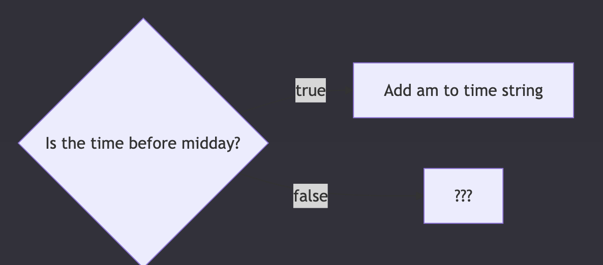

# Preparation
## 1. Clocks
### 12 vs 24 hour clock
### Learning Objectives
- [ ] Identify a pattern between a set of inputs and outputs produced by a given function
  
We usually write the time in one of two ways: the analogue 12 hour clock or the digital 24 hour clock. The 12 hour clock counts up to 12: it resets at midday. The 24 hour clock counts up to 24: it resets at midnight.

We use the notation “HH:MM”. HH is our stand-in for the hours value. MM is our stand-in for the minutes value.

__🧩 Stating the problem:__ 

Let’s pose a problem: given any time in 24 hour clock, we want to format it as a 12 hour clock time. To achieve this goal, we’re going to implement a function `formatAs12HourClock`.

```js
Given a time in 24 hour clock
When we call formatAs12HourClock()
Then we get back a string representing the same time in 12 hour clock.


🧪 Our tests:

I expect formatAs12HourClock("09:00") to be "09:00 am"
I expect formatAs12HourClock("14:19") to be "2:19 pm"
```

---

## 2. Comparison : 
### Learning Objectives
- [ ] Evaluate an expression that uses a comparison operator
- [ ] Explain when to use the === operator in a program
- [ ] List the values of the boolean type


### 2.1. Define current and target
Let’s start with a function declaration of `formatAs12HourClock`:
```js
function formatAs12HourClock() {}
```
Whenever we call `formatAs12HourClock` we expect it to return a particular value, which we call the `target output`. For example, we expect `formatAs12HourClock("08:00")` to return `"08:00 am"`. `"08:00 am"` is the __target output.__

However, the current output is what the function actually returns right now.

### 🏋🏻‍♀️ Exercise 1
Suppose we call the function like this:
```js
formatAs12HourClock("05:30");
```
When calling `formatAs12HourClock(‘05:30’)`, what is __the target output__?

<details>
<summary> Try to answer it before seeing the solution. </summary>

'05:30 am'
</details>


### 🏋🏻‍♀️ Exercise 2
Suppose we call the function like this:
```js
formatAs12HourClock("05:30");
```

When calling `formatAs12HourClock(‘05:30’)`, what is the current output?

<details>
<summary> Try to answer it before seeing the solution. </summary>

Undefined. Since the function is empty and has no return statement, it returns undefined by default.
</details>

### 2.2. Comparing values
We have learned how to log values to the console. We can also compare two values. We check that a function produces some target output with a comparison.

We compare the current output of `formatAs12HourClock("08:00")` with the target output of `"08:00 am"` and ask: are these two values the same? We use a comparison operator to compare two expressions and check if they evaluate to the same value. We use the strict equality operator `===` to check if two values are the same.

```js 
formatAs12HourClock("08:00") === "8:00 am";
``` 
`===` checks if the values on the left and right of the operator are the same. 


### 2.3. Boolean values
Some values are best represented as strings: any piece of text, a name, address, etc will most likely be stored using the string data type. The number data type can store numbers we use in calculations.

If we’re comparing two things, there are only two different states: `true` or `false`. This leads us to the `boolean` datatype, which only has `true` or `false` values. Whenever we compare two values with a comparison operator, we end up with a boolean value: `true` or `false`.

```js
// using the strict equality comparison expression

console.log(42 === 10 + 32);
// logs true

console.log(10 * 5 === 60);
// logs false
``` 

### 🏋🏻‍♀️ Exercise 1
Look at the code below and predict what each expression will evaluate to. Write your prediction down. Use the Node REPL to check your answers. Check out some [relevant documentation](https://developer.mozilla.org/en-US/docs/Web/JavaScript/Reference/Operators/Strict_equality) if you’ve not seen a particular operator before.

```js
true === false;
5 == 2 + 4;
4 * 5 == "20";
3 * 2 === 6;
Math.min(3, 4, 5) === 4;
let mhairiName = "Mhairi";
typeof mhairiName === "string";
let mhairiAge = 28;
let isMhairiOldEnoughToDrive = true;
let kilometersMhairiDrivesToWork = 9.4;
```


### 🏋🏻‍♀️ Exercise 2

Look at the code below and predict what each expression will evaluate to. Write your prediction down. Use the Node REPL to check your answers. Check out some [relevant documentation](https://developer.mozilla.org/en-US/docs/Web/JavaScript/Reference/Operators/Strict_equality) if you’ve not seen a particular operator before.

```js
"hello Mhairi" === `hello ${mhairiName}`;
"${mhairiName} is 28" === `Mhairi is ${mhairiAge}`;
isMhairiOldEnoughToDrive;
isMhairiOldEnoughToDrive === true;
mhairiAge >= 18;
29 <= mhairiAge;
Math.round(kilometersMhairiDrivesToWork) === 9;
``` 

### 🏋🏻‍♀️ Exercise 3
Look at the code below and then predict what the expression will evaluate to. Be sure to explain your answer too. Use the Node Repl to check your answer. Does the REPL output make sense?
```js
console.log(10 + 32) === 42;
```

---

## 3. Assertions
### Learning Objectives
- [ ] Describe the difference between `console.log` and `console.assert`
- [ ] Write an assertion to check for some behaviour of a given function
- [ ] Implement a piece of functionality specified in an assertion
- [ ] Given an assertion and a function declaration, identify and explain whether the assertion will succeed or fail
- [ ] Write an assertion for a function that implements a solution to a given problem

### 3.1. Define assertion
We now have 2 new concepts: `booleans` and `comparisons`. From these concepts, we can now write an assertion about the function `formatAs12HourClock`. __An assertion__ is a check that our code behaves in a particular way: this check can either succeed or fail.

So far we’ve used the log function `console.log`. We can write assertions using another function: `console.assert`. The documentation says that `console.assert` writes an error message to the console if the assertion is false. If the assertion is true, nothing happens. As `10 + 32 === 42` evaluates to true, no message will be written to the console. 

### 🏋🏻‍♀️ Exercise 1 : Experiment with assertions
Change the value assigned to the `result` variable to make the assertion fail. Check the output you get in the console.
```js
const calculation = 10 + 32;
const result = 42;
console.assert(calculation === result);
```
### 🏋🏻‍♀️ Exercise 2
Let’s look at an example using `formatAs12HourClock`:
```js
function formatAs12HourClock() {}
console.assert(formatAs12HourClock("08:00") === "08:00 am");
```
Predict and explain if the assertion will succeed or fail. Pay particular attention to the return value of `formatAs12HourClock`.

### 3.2. Clarity with arguments
It would be useful to have more information as to why this assertion failed. We can pass an additional argument to `console.assert`:
```js
function formatAs12HourClock() {}

console.assert(
  formatAs12HourClock("08:00") === "08:00 am",
  `current output: ${formatAs12HourClock("08:00")}, target output: 08:00 am`
);
```
Let’s break down these arguments to make sense of what’s going on:

1. first argument - `formatAs12HourClock("08:00") === "08:00 am"` - the condition we’re checking
2. second argument - `current output: ${formatAs12HourClock("08:00")}, target output: 08:00 am` - a message string that will be logged to the console if the condition is false.
   
#### 🧹 Refactor
We can tidy up the assertion even further. As we’re reusing the same expressions, we can store their result in variables with meaningful names so we can reuse them:

```js
function formatAs12HourClock() {}

const currentOutput = formatAs12HourClock("08:00");
const targetOutput = "08:00 am";
console.assert(
  currentOutput === targetOutput,
  `current output: ${currentOutput}, target output: ${targetOutput}`
);
``` 
Execute this code; we now get a log in the console:
```js
Assertion failed: current output: undefined, target output: 08:00 am
```
On line 3, the function is being passed a single argument `"08:00"`. But our function ignores it: it doesn’t declare any parameters. We can parameterise the function and label the input as `time`:

```js
function formatAs12HourClock(time) {}
```
According to our assertion, when we call our function with an input of `"08:00"` we need to create an output of `"08:00 am"`. If we add `"am"` to the time, we’ll get the target output. We can update our function with a template literal, set the return value and then re-run our code including our assertion to check the function is returning the correct value.

We can and should continually check our assertions to see if our function’s current output meets our target output.

```js
function formatAs12HourClock(time) {
  return `${time} am`;
}

const currentOutput = formatAs12HourClock("08:00");
const targetOutput = "08:00 am";
console.assert(
  currentOutput === targetOutput,
  `current output: ${currentOutput}, target output: ${targetOutput}`
);
``` 
Nothing is printed to the console, so this assertion is passing.

#### 🧪 Try it yourself
Create a javascript file on your local machine and execute the code above. Double check you are seeing the same output in your terminal.

### 3.3. Checking different cases

So far we’ve only created assertions that check the function’s behaviour for times between midnight and midday. In these cases, there is a pattern: take the current time and add `" am"` to the end.

But this isn’t the pattern we need to follow for all times. To make sure our function works for all times, we need to write more assertions.

We need to assert that the function behaves correctly when the time is later than midday.

Before we think about any code, we should think about our problem. Separating problem and code lets us focus better. First we can focus on the data. Then we can focus on the code.

First, let’s think of an example time in 24 hour clock - we’ll pick `23:00`.

Next, let’s work out what we expect our example time to be in 12 hour clock: `11:00 pm`.

Now that we’ve thought about the problem, we can write the code. Let’s create an assertion for our function when passed an input of `"23:00"`:

Save this code below to a file. Before you run it in Node, write down what you think will happen. Then run it with Node - compare what you saw with what you predicted.

```js
function formatAs12HourClock(time) {
  return `${time} am`;
}

const currentOutput = formatAs12HourClock("08:00");
const targetOutput = "08:00 am";
console.assert(
  currentOutput === targetOutput,
  `current output: ${currentOutput}, target output: ${targetOutput}`
);

const currentOutput = formatAs12HourClock("23:00");
const targetOutput = "11:00 pm";
console.assert(
  currentOutput === targetOutput,
  `current output: ${currentOutput}, target output: ${targetOutput}`
);
```

---

## 4. Interpreting errors
### Learning Objectives
- [ ] Interpret an error trace to identify which line in which file caused the error
- [ ] Identify an error message from an error trace
  
When we run the file with Node, we get an error in the console:

```node
% node clock-example.js
/Users/dwh/CYF/clock-example.js:12
const currentOutput = formatAs12HourClock("23:00");
      ^

SyntaxError: Identifier 'currentOutput' has already been declared
    at wrapSafe (node:internal/modules/cjs/loader:1383:18)
    at Module._compile (node:internal/modules/cjs/loader:1412:20)
    at Module._extensions..js (node:internal/modules/cjs/loader:1551:10)
    at Module.load (node:internal/modules/cjs/loader:1282:32)
    at Module._load (node:internal/modules/cjs/loader:1098:12)
    at TracingChannel.traceSync (node:diagnostics_channel:315:14)
    at wrapModuleLoad (node:internal/modules/cjs/loader:215:24)
    at Function.executeUserEntryPoint [as runMain] (node:internal/modules/run_main:158:5)
    at node:internal/main/run_main_module:30:49

Node.js v22.4.1
```
When an error is thrown, the program stops and an error report is sent to the user.

As programmers, we will see a lot of errors. It’s useful for us to be able to read them.

#### Interpreting the output
Each line of output here tells us something useful.

The first line is:

```node 
/Users/dwh/CYF/clock-example.js:12
```
Your output was probably different. But it will have the same parts. Some text, then a colon (:), then a number.

#### 🏋🏻‍♀️ Exercise : 
1. Work out what the parts of this line mean.
2. Why are they different on my computer than yours?
3. How can we use both pieces of information?

Often, looking at one line of a file is enough to understand what’s wrong. So the message also shows us a copy of the line that caused the problem:

```node 
const currentOutput = formatAs12HourClock("23:00");
``` 
Then the output tells us the error message:

```node 
SyntaxError: Identifier 'currentOutput' has already been declared
```

We may not know what this means yet, but it’s something we can learn about.

#### 🏋🏻‍♀️ Exercise : 
1. Write down three ways you could find out what this means.
   

Each line starting with “at” is showing us a “Stack trace”. We’ll skip over this for now. In the future we’ll see how it can be useful to us.

Finally, we have this line:

```node 
Node.js v22.4.1
```

#### 🏋🏻‍♀️ Exercise : 
What does this line mean? Why might it be useful to know this information?

---

## 5. Interpreting this error
### Learning Objectives
- [ ] Interpret an error message
- [ ] Break down an error message and look up unfamiliar parts
- [ ] Rephrase an error message

We saw this error - let’s try to understand it:

```node
SyntaxError: Identifier 'currentOutput' has already been declared
```
It can be useful to remember when our code last worked, and what we changed since then. Source control can help here. If you commit your code every time you make something work, you can use git to easily see what changed since your last commit.


When we just had the first 10 lines of code here, everything worked. 
```js
function formatAs12HourClock(time) {
  return `${time} am`;
}

const currentOutput = formatAs12HourClock("08:00");
const targetOutput = "08:00 am";
console.assert(
  currentOutput === targetOutput,
  `current output: ${currentOutput}, target output: ${targetOutput}`
);
```
When we added the rest, we got this `SyntaxError` error:

```js 
const currentOutput = formatAs12HourClock("23:00");
const targetOutput = "11:00 pm";
console.assert(
  currentOutput === targetOutput,
  `current output: ${currentOutput}, target output: ${targetOutput}`
);
```
__💡Tip :__ Run your code very often. If we changed one thing since our code last worked, we know what change is the problem. If we have written 100 lines of code since we last saw it work, we have 100 possible problems.

#### Interpreting the error message
The error message tries to tell us useful information:

```node
SyntaxError: Identifier 'currentOutput' has already been declared
``` 

When we get an error, we should make sure we understand all of the words in the error message. If we don’t, we should look them up or ask someone.

#### 🏋🏻‍♀️ Exercise : 
For each word in this error message, write down what it means.

If you don’t know a word, look it up.

Make sure you understand each word. Make sure you could explain the word to someone without reading the answer to them.

<details>
<summary> Expand for example definitions - only expand this after you have written yours down. Compare your answers with these. </summary>

- __SyntaxError:__ If we Google “JavaScript SyntaxError”, [MDN](https://developer.mozilla.org/en-US/docs/Web/JavaScript/Reference/Global_Objects/SyntaxError) tells us this is “an error when trying to interpret syntactically invalid code”. So - we wrote some code which isn’t allowed.
- __Identifier:__ If we Google “JavaScript Identifier”, [MDN](https://developer.mozilla.org/en-US/docs/Glossary/Identifier) tells us: this is “a sequence of characters in the code that identifies a variable, function, or property”. The identifier is the variable name: `currentOutput`.
- __currentOutput:__ This is the variable name we used in our code. This is the identifier that the error is about.
- __has, already, and been :__ are all standard English words with no special meaning.
- __declared :__ We learnt about this already in this course - a declaration is where we make a new name (e.g. a new variable) in JavaScript.
Reading that back, we can rephrase this error message:

We wrote some code which isn’t allowed. We tried to declare a new variable named `currentOutput`. But we had already declared something named `currentOutput`.

</details>

---

## 6. Reusing variable names
### Learning Objectives
- [ ] Fix code which declares the same identifier more than once

We saw this error:

```node 
SyntaxError: Identifier 'currentOutput' has already been declared
```
Now that we understand it, let’s fix it.

We’re not allowed to declare a new variable with the same name as an old one. Both lines 5 and 12 here try to declare a new variable named `currentOutput`:

```js
1  function formatAs12HourClock(time) {
2   return `${time} am`;
3  }
4
5  const currentOutput = formatAs12HourClock("08:00");
6  const targetOutput = "08:00 am";
7  console.assert(
8   currentOutput === targetOutput,
9   `current output: ${currentOutput}, target output: ${targetOutput}`
10  );
11 
12 const currentOutput = formatAs12HourClock("23:00");
13 const targetOutput = "11:00 pm";
14 console.assert(
15  currentOutput === targetOutput,
16  `current output: ${currentOutput}, target output: ${targetOutput}`
17 );
```

> __❗Remember:__ Make sure you understand the error message before you try to fix the code. If you don’t understand what’s wrong, you probably won’t be able to fix it!

#### Fixing the error

We want to do multiple assertions. And we’re using variables in our assertions. But we’re not allowed to use the same name twice. The simplest way we can fix this problem is by changing the name of the second variable. Remember to also change where we use the variable, not just where we declare it!

```js
function formatAs12HourClock(time) {
  return `${time} am`;
}

const currentOutput = formatAs12HourClock("08:00");
const targetOutput = "08:00 am";
console.assert(
  currentOutput === targetOutput,
  `current output: ${currentOutput}, target output: ${targetOutput}`
);

const currentOutput2 = formatAs12HourClock("23:00");
const targetOutput = "11:00 pm";
console.assert(
  currentOutput2 === targetOutput,
  `current output: ${currentOutput2}, target output: ${targetOutput}`
);
```

After making this change, let’s try running our code again. We get this output:

```node 
% node clock-example.js
/Users/dwh/CYF/clock-example.js:13
const targetOutput = "11:00 pm";
      ^

SyntaxError: Identifier 'targetOutput' has already been declared
    at wrapSafe (node:internal/modules/cjs/loader:1383:18)
    at Module._compile (node:internal/modules/cjs/loader:1412:20)
    at Module._extensions..js (node:internal/modules/cjs/loader:1551:10)
    at Module.load (node:internal/modules/cjs/loader:1282:32)
    at Module._load (node:internal/modules/cjs/loader:1098:12)
    at TracingChannel.traceSync (node:diagnostics_channel:315:14)
    at wrapModuleLoad (node:internal/modules/cjs/loader:215:24)
    at Function.executeUserEntryPoint [as runMain] (node:internal/modules/run_main:158:5)
    at node:internal/main/run_main_module:30:49

Node.js v22.4.1
```
Fortunately, we’ve seen this kind of error before. It’s exactly the same as the last one, but about the `targetOutput` variable on line 13, instead of the `currentOutput` variable on line 12.

#### 🏋🏻‍♀️ Exercise : 
Fix this error, and try running your code again. 

Now the second assertion fails with the following message:
```node
% node clock-example.js
Assertion failed: current output: 23:00 am, target output: 11:00 pm
```
We expect this. Our function just adds " am" to the end of the time, which only works for times in the morning. We have proven our code isn’t complete yet. Next we can fix it so that this test passes.

#### 🏋🏻‍♀️ Exercise : 
Write another assertion that checks `formatAs12HourClock` returns the target output when passed another time input in the afternoon.

---

## 7. Strategy
### Learning Objectives
- [ ] Propose a strategy for solving a problem
- [ ] Identify sub-problems within a larger problem

Our function works for morning inputs like `"08:00"`. In this case, the function returns the target output of `"08:00 am"` as required. However, at the moment, the output of `formatAs12HourClock("23:00")` is `"23:00 am"`.

💡 We need to execute some different logic when the time is beyond midday. 

We can interpret this behaviour as a question:



We need to make two changes to our code.
1. We need to do something different depending on whether the time is before midday. This is called running code conditionally. 
2. And then we need to know what we do if the time is after midday.
We don’t need to solve the whole problem at once. 

First let’s work out how to do something different depending on the time. We can worry about what we need to do differently once we’ve solved this problem.

__💡tip:__ It’s easier to search for the solutions to smaller parts of problems than the whole problem. Programming is all about breaking down problems into smaller pieces which we can solve.

---

## 8. Conditionality
### Learning Objectives
- [ ] Construct a flow diagram that describes how to produce an output from a given input
- [ ] Explain when it is necessary to use a conditional statement
- [ ] Identify the syntactic features of an if statement
- [ ] Analyse a conditional statement to determine whether or not the statement will be executed
- [ ] Determine the output of a program that uses a conditional statement

In programming, we can use an `if` statement to execute some code when a given condition is true. In JavaScript, we can write an `if` statement as follows:

```js
if (condition) {
  // do some code in here
}
```
The `if` statement consists of:
1. `if` keyword: this is the start of the if statement
2. `condition`: condition is an expression that evaluates to true or false. The condition must be in a pair of parentheses: ()
3. `{}`: a block statement: any code we want to execute if the condition is true goes inside the curly braces here
We can represent this with a diagram too:

#### 🏋🏻‍♀️ Exercise : 
```js
function checkDivisibility(a, b) {
  if (a % b === 0) {
    return `${a} is divisible by ${b}`;
  }

  return `${a} is not divisible by ${b}`;
}

console.log(checkDivisibility(10, 2));
console.log(checkDivisibility(50, 3));
``` 

Run the code above in [pythontutor](https://pythontutor.com/javascript.html#mode=edit). Step through each line in the code and work out happens each time the function is called.
1. What is the return value each time the function is called?
2. What value is assigned to the parameters `a` and `b` each time the function is called?

If you’ve not encountered any syntax before, remember to look it up in some documentation.

#### 🏋🏻‍♀️ Exercise : 
```js
function getCountryCode(phoneNumber) {
  if (phoneNumber.startsWith("+44")) {
    return "UK";
  }
}

getCountryCode("+447831620328");
getCountryCode("+989871783972");
``` 
Run the code above in [pythontutor](https://pythontutor.com/javascript.html#mode=edit). Step through each line in the code and work out happens each time the function is called.

1. What is the return value each time the function is called?
2. What value is assigned to the phoneNumber parameter each time the function is called?
3. Try describing the purpose of this function - what should it do?


---

## 9. Sub-goal
### Learning Objectives
- [ ] Define a sub-goal
- [ ] Explain why we use sub-goals

For `formatAs12HourClock` our strategy for inputs like `"23:00"` involves checking if the hours value is less than 12. For this purpose, we can use [the greater than comparison operator `>`.](https://developer.mozilla.org/en-US/docs/Web/JavaScript/Reference/Operators/Greater_than)

` > ` will check if the value on the operator’s left side is less than the value on the operator’s right side. So `3 > 12` evaluates to false, as `3` is not greater than `12`.

So provided we have an expression for hours, we can write an if statement as follows:

```js
if (/* here goes an expression here that evaluates to the hours */ < 12) {
  // do code to format the 12 hours
}
```
To complete the logic, we can form a sub-goal. __A sub-goal__ is a goal for a smaller problem that makes up some bigger problem .

Any time we’re solving a problem, we can define __a goal__ - a thing we need to achieve to consider the problem solved. We can break a problem into smaller problems, each with its own __sub-goal__. The problem-solving process involves continually breaking down problems into smaller manageable problems, each with its own sub-goal.

For the implementation of `formatAs12HourClock`, we can form a sub-goal as follows:

__🎯 Sub-goal:__ Find the hours value from the time input

---

## 10. Strings
### Learning Objectives
- [ ] Define zero-indexing
- [ ] Given a short program, determine the return value of a call to slice on a string before execution
- [ ] Describe how to convert a string into a number in JavaScript

Given a `time` string we need to access the first 2 characters of the string which represent the hours.

Strings are zero-indexed. Index means position, so zero-indexed means we start counting character positions from `0` onwards.

Here are the positions/indexes for `"23:00"`

| Index | 0 | 1 | 2 | 3 | 4 |
|:------|:-:|:-:|:-:|:-:|:-:|
| Character | "2" | "3" | ":" | "0" | "0" |

In JavaScript, we can use square bracket notation to access specific characters in the string using the index.

```js
time[0]; // evaluates to "2"
time[1]; // evaluates to "3"
time[2]; // evaluates to ":"
// etc
``` 
Square bracket access will only give a single character. We must use another method to extract multiple characters from the given string.

### ✂️ Extracting a slice
To extract 1 or more characters from a string, we can use a function called `slice()`. `Slice` is a function that can take 2 arguments: a start index and an end index. Slice will return a section of the string from the start index up to but not including the end index.

```js
time; // holds the value "23:00"
``` 
```js
time.slice(0, 2); // will access the characters below
```

| Index | 0 | 1 |
|:------|:-:|:-:|
| Character | "2" | "3" |

So `time.slice(0,2)` will evaluate to `"23"` when the time is `"23:00"`.

Finally we must convert "23" to the number 23, otherwise we can’t compare this value properly.

#### 🏋🏻‍♀️ Exercise : 
- Think about the numbers 100 and 23. Which one is bigger?
- Write code which compares the strings "100" and "23" and tells you which one is bigger.
- Does this match your expectation? If not, what do you think is happening?

JavaScript uses different ways to [compare values](https://developer.mozilla.org/en-US/docs/Web/JavaScript/Guide/Equality_comparisons_and_sameness) depending on their types. If you compare two strings (which may contain numbers), it will do something different than if you compare two numbers. We can use the `Number()` function to convert the string into a number.

#### 🏋🏻‍♀️ Exercise : 
- Work out how you can convert the strings `“100”` and `“23”` to numbers.
- Write code which compares the numbers `100` and `23` and tells you which one is bigger.

---

## 11. Testing a sub-goal
### Learning Objectives
- [ ] Test a solution to a sub-goal before solving the whole problem

Earlier we defined a __sub-goal__ to find a value for the hours from the time input. We’ve found that `Number(time.slice(0,2))` is an expression that evaluates to the hours from `time`. So we can write an if statement using this expression:

```js
if (Number(time.slice(0, 2)) > 12) {

}
``` 
If the time is `"23:00"` then the expression `Number(time.slice(0, 2)) > 12` will evaluate to `true` and the body of the if statement will be executed.

We can check that we are correctly identifying times in the afternoon by adding in our if statement (which we think is correct), with a placeholder body:

```js
function formatAs12HourClock(time) {
  if (Number(time.slice(0, 2)) > 12) {
    return "Don't know how to handle times in the afternoon yet";
  }
  return `${time} am`;
}

const currentOutput = formatAs12HourClock("08:00");
const targetOutput = "08:00 am";
console.assert(
  currentOutput === targetOutput,
  `current output: ${currentOutput}, target output: ${targetOutput}`
);

const currentOutput2 = formatAs12HourClock("23:00");
const targetOutput2 = "11:00 pm";
console.assert(
  currentOutput2 === targetOutput2,
  `current output: ${currentOutput2}, target output: ${targetOutput2}`
);
``` 
If we run our code, we expect the current output of the 23:00 test-case to have changed. It won’t be correct - the assertion will still fail. But if it hasn’t changed, we know our if statement is wrong.

```node
% node clock-example.js
Assertion failed: current output: Don't know how to handle times in the afternoon yet, target output: 11:00 pm
```

Even though we know the code on line 3 is incorrect, this was a useful step. It allowed us to run our code more often, and check that we’re on the right track. 

> __❗Remember:__ Run your code as often as you can. Make small changes and run your code. Sometimes we write code we know we will delete because it lets us get feedback sooner.

Now we can focus on just one problem: how to handle times after midday (i.e. fixing line 3). We don’t need to worry about both detecting the time and handling it.

If the output of this assert still printed `"23:00 am"` we would have stopped here and debugged that. Again, we could focus on just one problem.

---

## 12. Sub-goal #2
### Learning Objectives
- [ ] Explain how different concepts are combined to solve a goal
  
Now we can think about what we do when we’ve identified a time is after midday.

Earlier, we observed what to do when the time goes beyond midday: subtract 12 from the hours time to get the new hours for the 12 hour clock time.

Before writing code, we can define our approach in steps:

Starting with an input like "23:00":


Now we can format the string using our approach from earlier: we’ll need to append `"pm"` to the string expression and subtract 12 from the hours. So we get the following: 

```js
if (Number(time.slice(0, 2)) > 12) {
  return `${Number(time.slice(0, 2)) - 12}:00 pm`;
}
``` 
The return statement above implements the following steps we set out earlier:
- subtract 12 from the hours
- add 'pm' to the rest of the time
- return the new time

Now we can re-run our assertions from earlier to check our function behaves as target.

---

## 13. Refactoring repetition
### Learning Objectives
- [ ] Refactor code to remove duplication
- [ ] Explain why duplicated code can cause problems

Let’s look at our code, which passes all of the tests we’ve written:
```js
function formatAs12HourClock(time) {
  if (Number(time.slice(0, 2)) > 12) {
    return `${Number(time.slice(0, 2)) - 12}:00 pm`;
  }
  return `${time} am`;
}

const currentOutput = formatAs12HourClock("08:00");
const targetOutput = "08:00 am";
console.assert(
  currentOutput === targetOutput,
  `current output: ${currentOutput}, target output: ${targetOutput}`
);

const currentOutput2 = formatAs12HourClock("23:00");
const targetOutput2 = "11:00 pm";
console.assert(
  currentOutput2 === targetOutput2,
  `current output: ${currentOutput2}, target output: ${targetOutput2}`
);
``` 

Inside the `formatAs12HourClock` function we do exactly the same thing twice.

#### 🏋🏻‍♀️ Exercise : 
Identify the two bits of code inside formatAs12HourClock that do exactly the same thing.

There are a few reasons this isn’t ideal.
1. It’s not clear what this value represents. You can read it and work it out, but that takes some time.
2. Doing the same thing twice is slower than doing it once.
3. In the future if we need to change this code’s implementation, we would need to change it twice.
Right now our code assumes the hours in a time are always two digits (like 05:00). What if we wanted to support single-digit hours, like `5:00`? We would need to make the same change to both lines. It would be easy to change one line and forget the other, which would lead to a bug.

### Refactor
Once your code passes your test, look for ways you could make your code better. This doesn’t mean changing what it does - the code works. It means changing how it’s written.

This is called __refactoring__. To refactor means to update our code quality without changing the implementation. Changing how it does something, not changing what it does.

We can refactor our code to remove this duplication by introducing a variable:

```js
function formatAs12HourClock(time) {
  const hours = Number(time.slice(0, 2));
  if (hours > 12) {
    return `${hours - 12}:00 pm`;
  }
  return `${time} am`;
}

const currentOutput = formatAs12HourClock("08:00");
const targetOutput = "08:00 am";
console.assert(
  currentOutput === targetOutput,
  `current output: ${currentOutput}, target output: ${targetOutput}`
);

const currentOutput2 = formatAs12HourClock("23:00");
const targetOutput2 = "11:00 pm";
console.assert(
  currentOutput2 === targetOutput2,
  `current output: ${currentOutput2}, target output: ${targetOutput2}`
);
``` 
This code does exactly the same thing as the previous code. But it is better in a few ways:
1. We can now tell more easily what this expression represents. The variable name conveys: it’s the hours from the time.
2. We only compute the hours once, not twice, which will be a little bit faster.
3. If we need to change how we identify the hours (e.g. to support single-digit hours), we only need to update one bit of code. Both lines 3 and 4 will automatically use the same value, because they’re referring to the same variable.

> __💡Code Quality :__
Whenever you finish implementing a sub-goal, or a goal, read your code and look for ways to refactor it. This will make your code easier to continue working on.

---

## 14. Identifying missing tests
### Learning Objectives
- [ ] Define groups of input
- [ ] Define edge cases
- [ ] Identify groups of input for a function
- [ ] Identify edge cases for a function

We started off writing one test for our code - checking that it correctly handled the input 08:00. We wrote an implementation that passed all our (1) tests!

Then we realised there was a bug - it didn’t handle times after midday correctly. So we wrote another test - for the input 23:00. We saw our implementation failed that test. And we fixed it. And we had an implementation that passed all our (2) tests!

When will we be happy that our implementation works for all possible inputs? When do we have enough tests?

### Groups of input
One way to approach this is to think about what groups of input our problem may have.

We’ve already identified two examples of groups of input to the problem of converting 24 hour clocks to 12 hour clocks: Times before midday and times after midday.

One way to find extra cases to consider (and extra tests to write) is to try to think of different groups of input.

For example, some times are exactly on the hour (end in :00) and other times have a non-zero number of minutes.

#### 🏋🏻‍♀️ Exercise : 
Set a timer for 5 minutes. Write down as many groups of input to this problem as you can. Write an example assertion for each one.

If you find any bugs in the implementation, go fix them!


### Edge cases
Another way to consider this question is to think about what edge cases there are in the problem.

__Edge case :__ An edge case is an unusual value which may need special treatment. Some examples are: the minimum value, the maximum value, and the boundary between two groups of input.

Some example edge cases for this problem are: 
- `00:00` The minimum time, which is `12:00 am` in 12 hour clock.
This is also the only hour that is bigger in 12 hour clock than 24 hour clock.
- `24:00` The maximum time.
- `12:00` Where time changes from `am` to `pm`. The edge between morning times and afternoon times.
  
Often these edge cases are where bugs happen.

#### 🏋🏻‍♀️ Exercise : 

Set a timer for 5 minutes. Write down as many edge cases of input to this problem as you can. Write an example assertion for each one.

If you find any bugs in the implementation, go fix them!